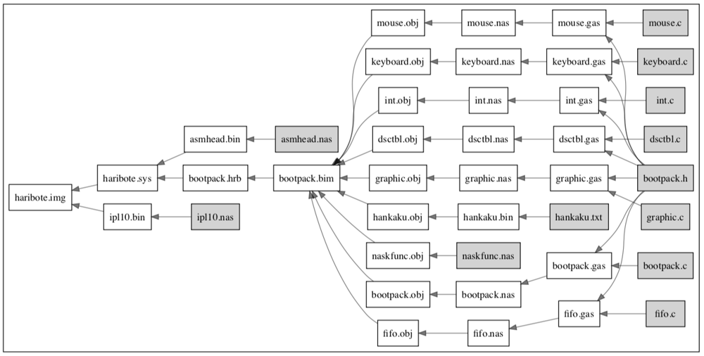

# Makevizzy

A simple Makefile visualizer.

This is a Rust rewrite of a Python script that visualizes Makefile targets, dependencies, and related files.

## Usage

```sh
git clone git@github.com:InvisOn/makevizzy.git
cd makevizzy
cargo install --path .
# in a directory with a Makefile
LANG=C make -p | makevizzy | dot -Tpdf -o workflow.pdf
```

## Result

 

## Acknowledgement

- [kshramt](https://qiita.com/kshramt/items/dace8875d9686475f6cd) for the original Python code.
